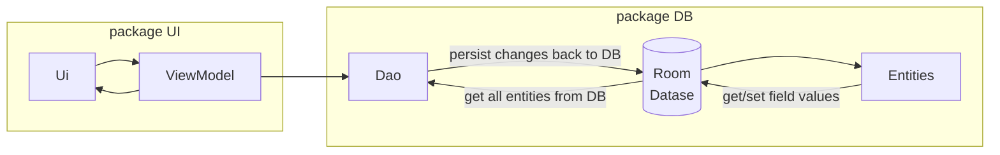

```mermaid
flowchart LR
 subgraph s1["package DB"]
        Dao["Dao"]
        database["Room<br>Datase"]
        n1["Entities"]
  end
 subgraph s2["package UI"]
        Ui["Ui"]
        ViewModel["ViewModel"]
  end
    Ui --> ViewModel
    ViewModel --> Ui & Dao
    Dao -- persist changes back to DB --> database
    database -- get all entities from DB --> Dao
    database --> n1
    n1 -- get/set field values --> database

    database@{ shape: cyl}
    n1@{ shape: rect}
```
